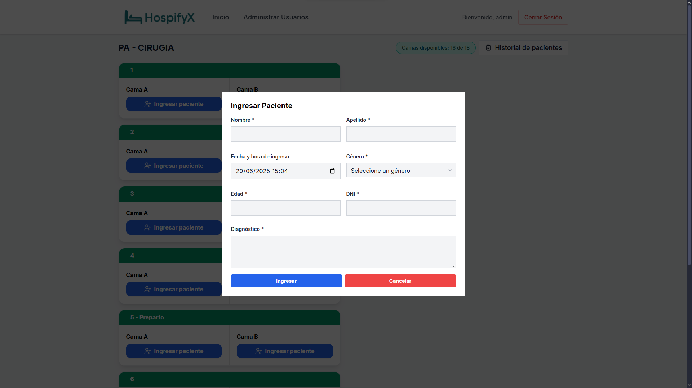
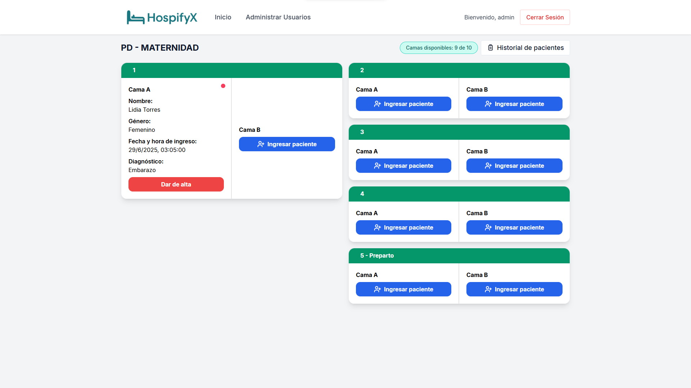
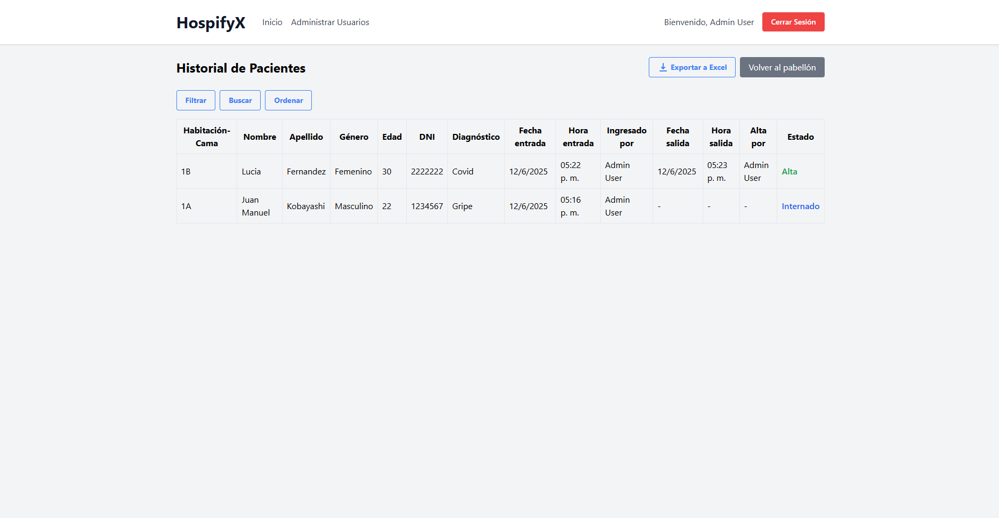
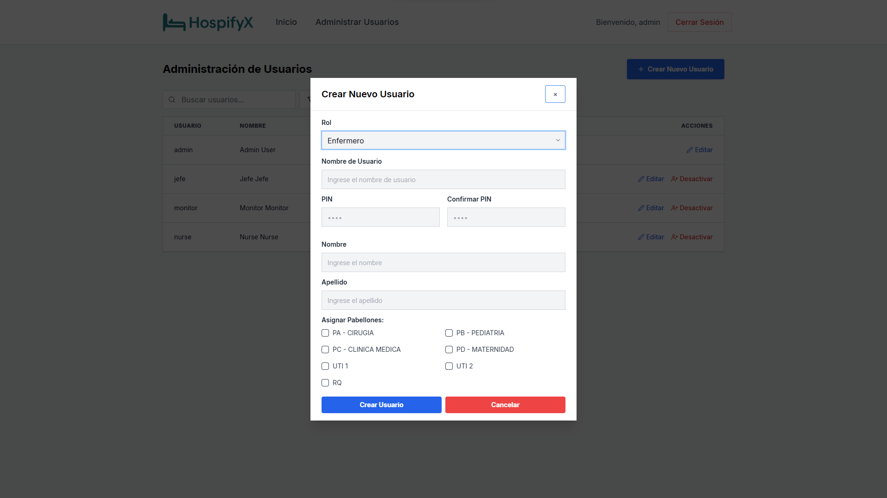
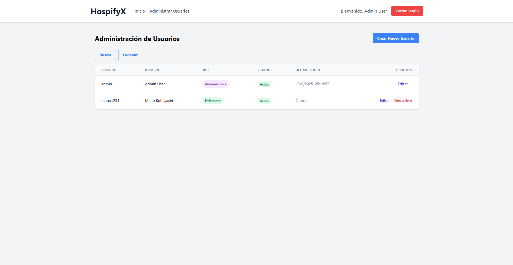

# HospifyX (Portfolio)

> ⚠️ Este repositorio es una muestra de portafolio de mi proyecto "HospifyX". El código fuente completo es privado por motivos comerciales, pero aquí encontrarás una descripción detallada y capturas de pantalla.

## Descripción

HospifyX es una solución integral para la gestión hospitalaria, diseñada para optimizar procesos médicos, administrativos y de atención al paciente internado. El sistema permite gestionar historiales clínicos electrónicos y la asignación y control de camas para internación.

> 🚧 **La aplicación sigue en desarrollo y se continúan agregando nuevas funcionalidades y mejoras.**

## Características principales

- Gestión de usuarios y roles con autenticación JWT y control de acceso.
- Visualización y administración de pabellones, habitaciones y camas en tiempo real.
- Ingreso y alta de pacientes en camas, con historial clínico electrónico básico.
- Estadísticas de ocupación y disponibilidad de camas por pabellón.
- Dashboard con métricas y reportes en tiempo real.
- Formularios validados y seguros para operaciones críticas.
- Comunicación segura entre personal médico (WebSocket).
- Arquitectura modular y escalable, lista para integración de módulos futuros.
- UI responsiva y accesible, optimizada para desktop y tablets.

## Tecnologías utilizadas

- **Frontend:** React, Vite, TailwindCSS
- **Backend:** Node.js, Express, WebSocket
- **Base de datos:** PostgreSQL (ORM Prisma)
- **Infraestructura:** Nginx

## Capturas de pantalla

**Login**

**Dashboard**

**Admisión de paciente**

**Vista de paciente**

**Historial del paciente**

**Creación de usuario**

**Vista de usuario**

## Arquitectura

- Separación total entre frontend (React) y backend (Node.js/Express).
- Backend con API RESTful y WebSocket para comunicación en tiempo real.
- Autenticación y autorización basada en JWT y control de roles.
- Seguridad reforzada: Helmet, rate limiting, CORS y logging avanzado.
- Base de datos relacional PostgreSQL gestionada con Prisma ORM.
- Arquitectura modular y escalable, preparada para integración de nuevos módulos.
- Infraestructura lista para despliegue con Nginx.

## ¿Por qué el código es privado?

El código fuente de este proyecto es privado para proteger la propiedad intelectual y la ventaja competitiva. Si eres reclutador y deseas discutir detalles técnicos, contáctame.

## Contacto

- [LinkedIn](https://www.linkedin.com/in/juanmanuelkobayashi02/)
- [Email](juanmanuelkobayashi@email@gmail.com)

---

> _Este README es solo para fines de presentación profesional. El código completo puede ser mostrado bajo acuerdo de confidencialidad en entrevistas técnicas._
