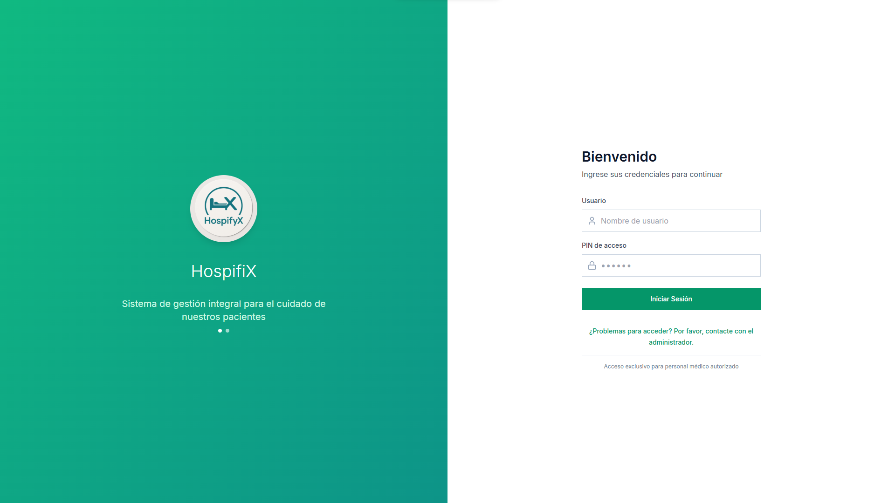
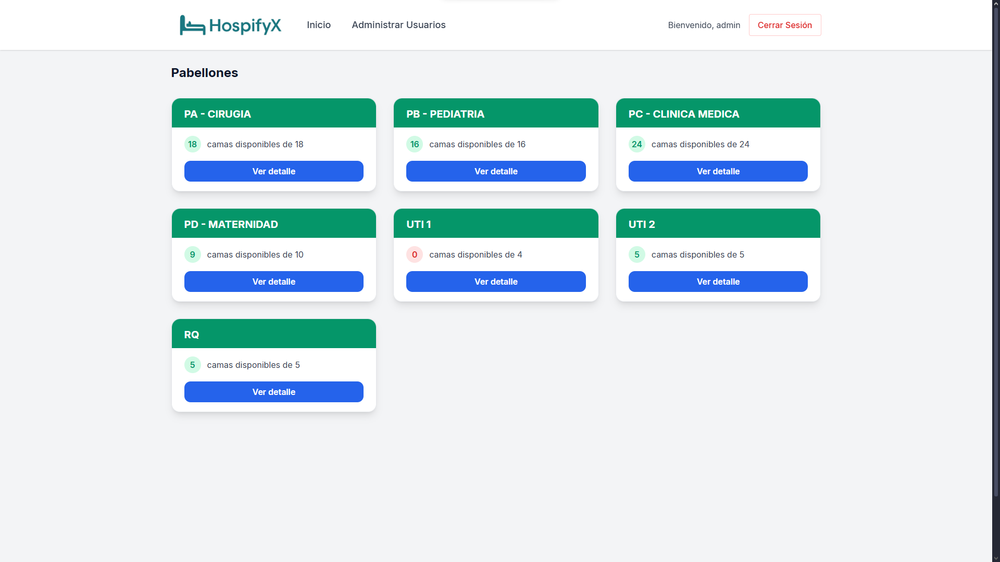

# HospifyX (Portfolio)

> ⚠️ Este repositorio es una muestra de portafolio de mi proyecto "HospifyX". El código fuente completo es privado por motivos comerciales, pero aquí encontrarás una descripción detallada, capturas de pantalla y enlaces a la demo.

## Descripción

HospifyX es una solución integral para la gestión hospitalaria, diseñada para optimizar procesos médicos, administrativos y de atención al paciente. Incluye módulos para la gestión de historiales clínicos, turnos, inventarios y comunicación interna.

## Características principales

- Gestión de expedientes clínicos electrónicos.
- Asignación y control de camas y turnos médicos.
- Inventario de medicamentos y materiales.
- Comunicación segura entre personal médico.
- Dashboard de métricas y reportes en tiempo real.

## Tecnologías utilizadas

- **Frontend:** React, Vite, TailwindCSS
- **Backend:** Node.js, Express, WebSocket
- **Base de datos:** PostgreSQL (ORM Prisma)
- **Infraestructura:** Nginx, Docker (opcional)

## Demo

Puedes ver una demo funcional aquí:  
[Enlace a la demo en línea](https://tu-demo.com)  
*(o adjunta un video demostrativo o GIFs en la sección de capturas)*

## Capturas de pantalla

*(Agrega aquí más capturas relevantes)*

## Arquitectura

- Arquitectura modular con separación de frontend y backend.
- Autenticación JWT para seguridad y control de acceso.
- Integración con APIs externas de salud y notificaciones.
- Uso de WebSocket para comunicación en tiempo real.

## ¿Por qué el código es privado?

El código fuente de este proyecto es privado para proteger la propiedad intelectual y la ventaja competitiva. Si eres reclutador y deseas discutir detalles técnicos, contáctame por [email](mailto:tu-email@dominio.com).

## Contacto

- LinkedIn: [linkedin](https://www.linkedin.com/in/juanmanuelkobayashi02/)
- Email: juanmanuelkobayashi@email@gmail.com

---

> _Este README es solo para fines de presentación profesional. El código completo puede ser mostrado bajo acuerdo de confidencialidad en entrevistas técnicas._
